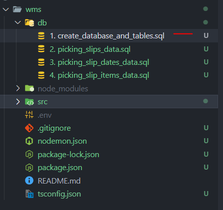
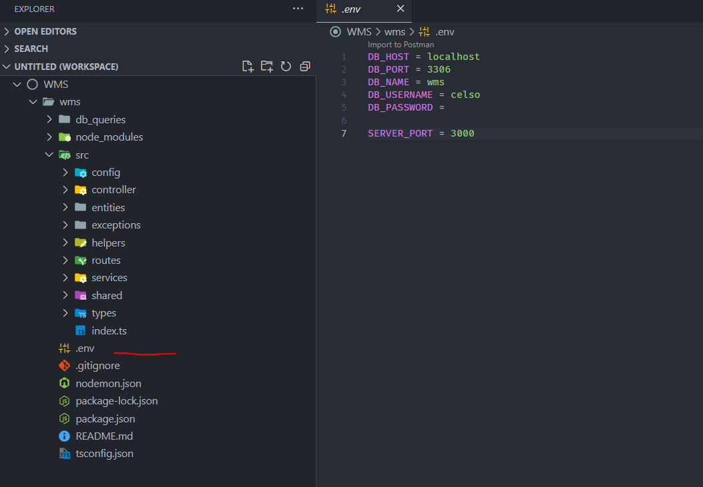
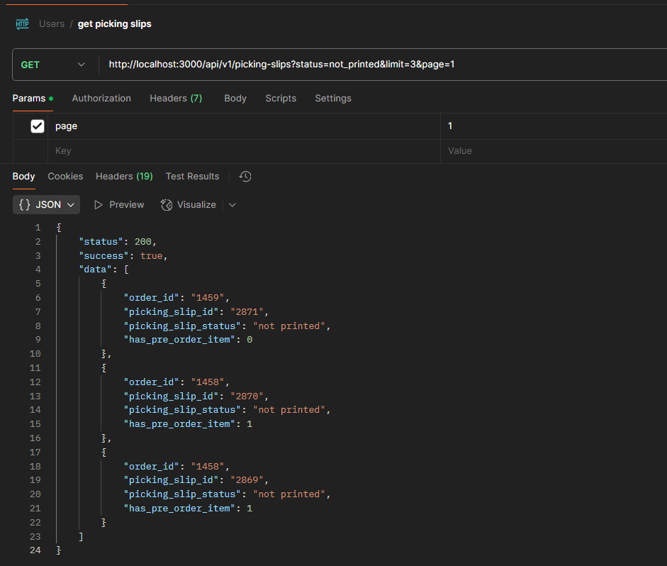

# Prerequisites:

Before running the app, ensure you have the following installed in your computer:

- Node.js
  - Download here: https://nodejs.org/en/download
- MySQL
  - I’m using XAMPP to serve MySQL, you can download the application from this link: https://www.apachefriends.org/
  - You also have the option to install MySQL separately. Here's a guide to help you:
    - Windows:https://www.youtube.com/watch?v=a3HJnbYhXUc
    - Mac: https://www.youtube.com/watch?v=ODA3rWfmzg8
    - Linux: https://www.youtube.com/watch?v=zRfI79BHf3k

# Instructions:

1. Download the repository from this link: https://github.com/celsolagguijr/wms
2. Open a terminal and go to the project directory.
3. Install the application's dependencies by running this command:
   - `npm install`
4. Set up the database.
   - Open your SQL management tool, if you don’t have you can download here:
     - MySQL Workbench: https://dev.mysql.com/downloads/workbench/
   - Open the `1.create_database_and_tables.sql` file located in the `db` folder and run the commands.
     
   - Populate the tables by executing the insert commands in the order of the following files:
     1. `2. picking_slips_data.sql`
     2. `3. picking_slip_dates_data.sql`
     3. `4. picking_slip_items_data.sql`
5. Create a `.env` file in the root directory and set the environmental variable of the application.
   
6. Run the application by executing this command on your terminal
   - `npm run dev`
7. End point:
   - Get all picking slips
     - Endpoint: `api/v1/picking-slips`
       - Method: GET
       - Query Params:
         - status `string`
           - printed
           - not_printed
           - held
         - page `number`
         - limit `number`
   - Example: `/api/v1/picking-slips?status=not_printed&limit=3&page=1`
     
